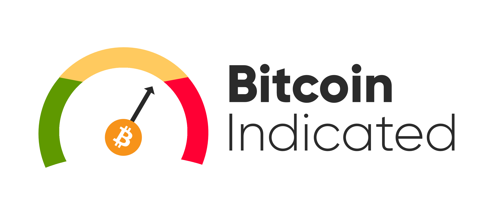

## Introduction

<p align="center">
  <br>
  <b>A very simple indicator for Bitcoin...</b>
</p>

Overwhelmed by the trading indicators? We use the famously existing indicators and output a simple, human-friendly indicator. It will classify if one **definitely** | **maybe** should **buy** | **hold** | **sell** his/her/theirs bitcoin asset.

*Tags: bitcoin, trading, indicators*

[]()
[]()

## Attributions
- [Crypto Market Cap & Pricing Data Provided By Nomics](https://nomics.com)

- [Powered by CoinDesk](https://www.coindesk.com/price/bitcoin)

## Disclaimer
Technical indicators aim to help users read, analyze, and predict future price movement. However, the basis of cryptocurrencies (excluding fiat-based ones) has historically been highly volatile.

**In no event shall the authors or copyright holders be liable for any claim, damages or other liability, whether in an action of contract, tort or otherwise, arising from, out of or in connection with the software or the use or other dealings in the software.**

## Getting Started
Follow these instructions to get the project up and running.

### Numerical classification

-100 to -70  | -70 to -40  | -40 to 40  | 40 to 70  | 70 to 100
--|---|---|---|--
Definitely should buy  | Maybe should buy | Maybe should hold | Maybe should sell |  Definitely should sell

### Prerequisites

These are what you **must** install before using our project.

1. [Pandas](https://pandas.pydata.org/)

2. [Matplotlib](https://pypi.org/project/matplotlib/)


Your local machine must also have Python 3 (≥ 3.7) installed beforehand.

### Run

For a basic usage, use this command
  ```
  python main.py -a
  ```
or
  ```
  python main.py --all
  ```
This command should download the data from sources, preprocess them, train, and export predictions.
<br><br><br>
For full list of available commands, use
  ```
  python main.py --help
  ```

### GitHub
Make sure you always clone and pull the latest version from Pandemic Central.
**Our repository can always be found at https://github.com/caominhduy/bitcoin-indicated.**

## Authors
* [**Duy Cao**](https://github.com/caominhduy/)
